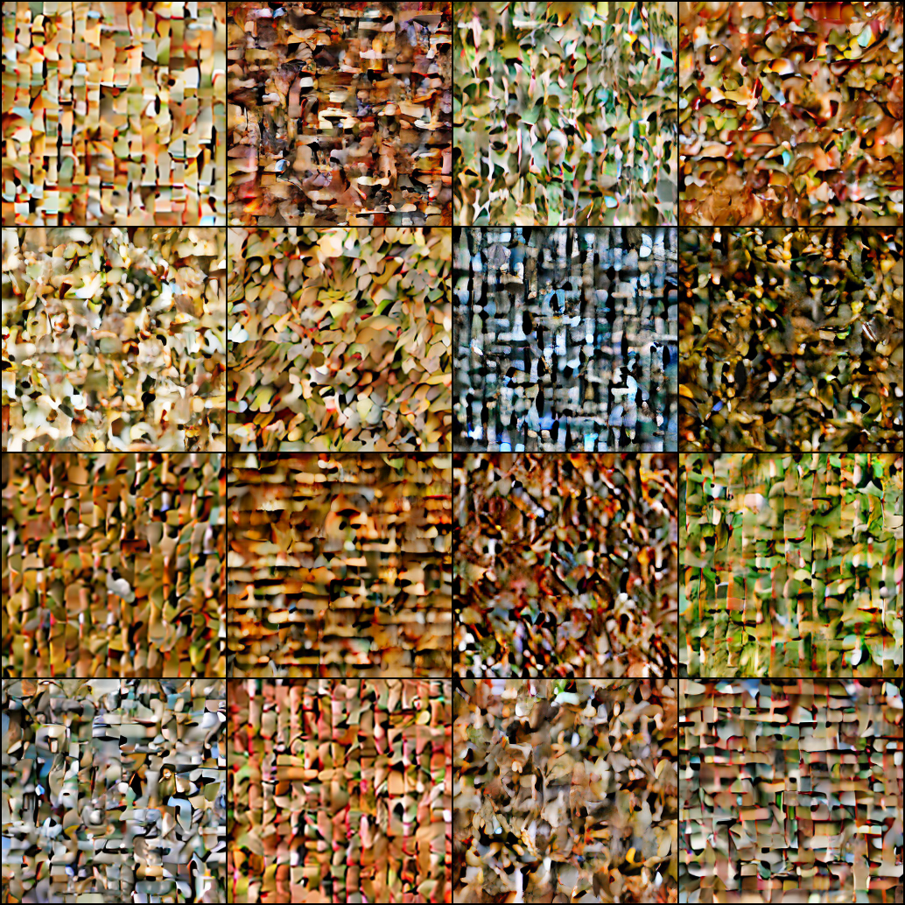
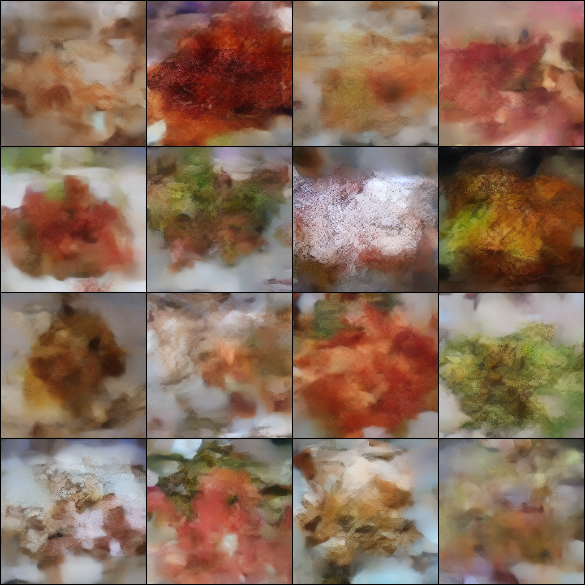
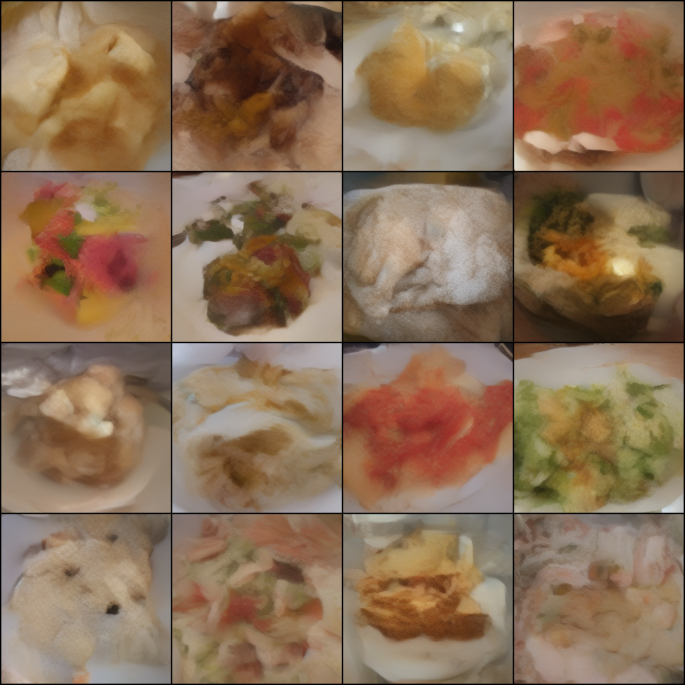
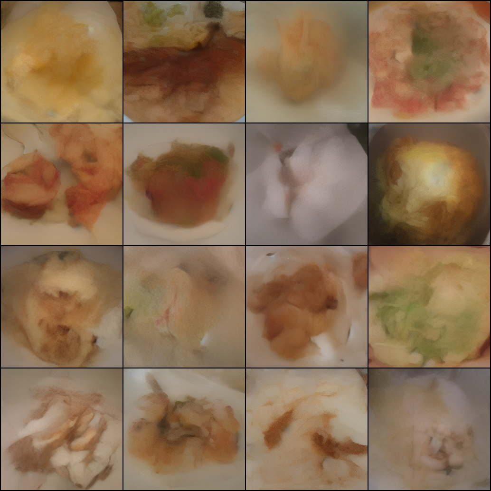

# DART Training Report: Food-101

**Date:** April 2026
**Dataset:** [Food-101](https://data.vision.ee.ethz.ch/cvl/datasets_extra/food-101/) (75,750 training images, 101 food categories)

## Why Food-101

CIFAR-10 images are 32x32 upscaled to 256x256. No matter how long you train, the output is blurry because the source data is blurry. Food-101 has real photographs at native high resolution. This run tests whether the model can actually produce sharp, detailed images when given proper training data.

## Configuration

Same architecture and hyperparameters as the CIFAR-10 runs, just swapped the dataset.

| Setting | Value |
|---------|-------|
| Model | DART-S, 31.9M params |
| Dataset | Food-101, 75,750 images, 101 classes |
| RoPE | 3-axis decomposed (16, 24, 24) |
| Loss weighting | Uniform |
| T | 4 denoising steps |
| Batch size | 8 |
| Steps | 100,000 |
| AMP | bf16 |
| Latent cache | On local disk (not OneDrive) |

## Sample Progression

Each grid shows 16 samples (one per class for the first 16 of 101 food categories).

### Step 5,000

Blocky noise with food-like color palettes (browns, greens, reds). No structure.

### Step 20,000

Plate shapes and food blobs appearing. The model has picked up that most images have a round plate on a table. Colors are starting to differentiate by class.

### Step 50,000

Actual food shapes. You can see salads (greens), meats (browns), sauces (reds), plates with garnishes. Some images have recognizable plating. The model is producing textures that look like real food photography, not the pixel soup that CIFAR-10 gives.

### Step 100,000

Best results from this run. Food items sit on plates with realistic lighting and shadows. Broccoli, tomatoes, fried foods, salads are distinguishable. Still blurry at fine detail, but the overall composition and color are clearly food photos, not abstract patterns.

## Comparison with CIFAR-10

The difference is night and day. CIFAR-10 at 100K steps produces recognizable but fundamentally blurry images because the source data is 32x32. Food-101 at 100K produces images that actually look like photographs, just soft. The model's capacity isn't the bottleneck here, the data is.

That said, 100K steps with batch_size=8 means the model only saw each image ~10 times. With 101 classes and 750 images per class, the model hasn't had enough exposure to learn fine per-class details. More training would help.

## What Worked

- **Latent caching on local disk**: After the OneDrive I/O disaster with CIFAR-10, saving the latent cache to `C:\dart_checkpoints\` kept training at a steady 10.4 it/s through every checkpoint save.
- **3D RoPE (fixed)**: This is the first run with correct 3-axis decomposed RoPE frequencies. The inv_freq buffer bug was fixed by not registering it as a PyTorch buffer.
- **Native resolution data**: The jump in visual quality from CIFAR-10 to Food-101 confirms the model architecture works. The previous blurriness was a data problem, not a model problem.

## Limitations

- **Only 100K steps**: The paper trains for much longer. 100K steps with batch_size=8 on 75K images is only ~10 epochs. More training would sharpen results.
- **101 classes is a lot for 32M params**: DART-S might not have enough capacity to learn 101 distinct food categories well. The paper uses 812M params for 1000 ImageNet classes.
- **T=4 denoising steps**: The paper uses T=16. More steps = finer denoising, but T=4 is a VRAM constraint.
