# DART Training Report: ImageNet 256x256

**Date:** April 2026
**Dataset:** ImageNet-1K (ILSVRC 2012), 1.28M training images, 1000 classes

## Run History

| Run | Steps | Batch | T | Classes | Infra | Best FID |
|-----|-------|-------|---|---------|-------|----------|
| Run 1 | 200K | 8 | 4 | 941 | Local RTX 4080 | 154.90 (CFG=1.5) |
| Run 2 | 800K | 32 | 8 | 1000 | Modal A100 | **85.08** (CFG=4.0) |

## Run 2: Cloud Training (800K steps)

### Configuration

| Setting | Value |
|---------|-------|
| Model | DART-S, 32.3M params |
| Dataset | ImageNet 256x256, 1.28M images, 1000 classes |
| RoPE | 3-axis decomposed (16, 24, 24) |
| Loss weighting | Uniform |
| T | 8 denoising steps |
| Batch size | 32 |
| Steps | 800,000 |
| LR | 3e-4, cosine decay with 10K warmup |
| AMP | bf16 |
| Infra | Modal A100-SXM4-40GB |
| Latent cache | VAE-encoded, persisted on Modal volume |

### What differs from the paper

| | Paper | Run 2 |
|-|-------|-------|
| Model | DART-XL, 812M params | DART-S, 32M params |
| T | 16 | 8 |
| Batch size | 128 | 32 |
| Training steps | Not disclosed | 800K |

### FID

50K generated samples against 50K ImageNet reference images streamed from HuggingFace.

| CFG scale | FID |
|-----------|-----|
| 1.5       | 140.63 |
| 2.5       | 97.90 |
| 4.0       | **85.08** |
| 6.0       | 85.17 |

FID drops through CFG=4.0 and plateaus by 6.0.

Paper DART-XL (812M, T=16): 3.98 FID.

### CFG Comparison

Three classes across four CFG scales.

| Class | CFG=1.5 | CFG=2.5 | CFG=4.0 | CFG=6.0 |
|-------|---------|---------|---------|---------|
| 207 golden retriever | 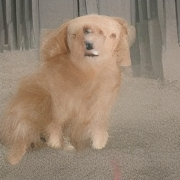 | 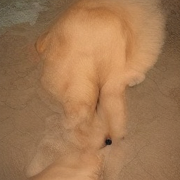 | 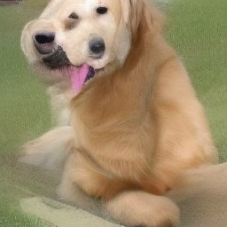 | 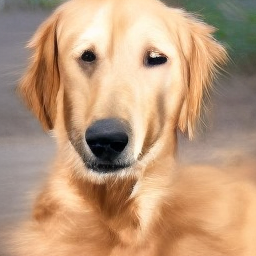 |
| 340 zebra | 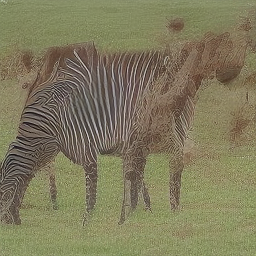 | 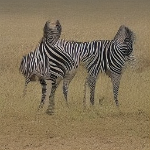 | 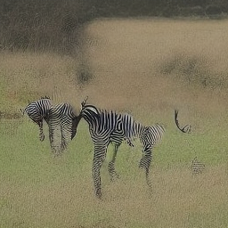 | 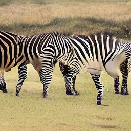 |
| 963 pizza |  | 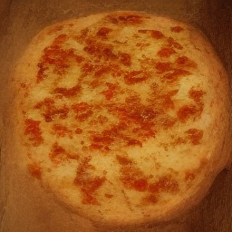 | 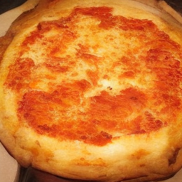 | 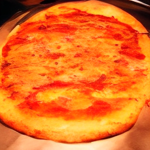 |

### Sample Progression

Same 12 classes from checkpoints along the 800K run. CFG=1.5, T=8. Classes left to right, top to bottom: tench, ostrich, jellyfish, golden retriever, tabby cat, lion, zebra, panda, sports car, pizza, daisy, goldfish.

#### Step 10,000

#### Step 50,000

#### Step 100,000

#### Step 200,000

#### Step 400,000

#### Step 800,000

### Samples

One sample per class from the 50K FID set. CFG=1.5, T=8, step 800K EMA.

| Class | Sample |
|-------|--------|
| 0 tench |  |
| 9 ostrich |  |
| 107 jellyfish |  |
| 207 golden retriever |  |
| 281 tabby cat |  |
| 291 lion |  |
| 340 zebra |  |
| 388 panda |  |
| 817 sports car |  |
| 963 pizza |  |
| 985 daisy |  |

## Run 1: Local Training (200K steps)

### Configuration

| Setting | Value |
|---------|-------|
| Model | DART-S, 31.9M params |
| Dataset | ImageNet 256x256, 1.2M images, 941 classes |
| RoPE | 3-axis decomposed (16, 24, 24) |
| Loss weighting | Uniform |
| T | 4 denoising steps |
| Batch size | 8 |
| Steps | 200,000 |
| LR | 3e-4, cosine decay with 10K warmup |
| AMP | bf16 |
| Latent cache | Memory-mapped numpy on local disk |

Limited by 16GB VRAM.

### Sample Progression

16 samples from the first 16 ImageNet classes.

#### Step 10,000

#### Step 50,000

#### Step 100,000

#### Step 200,000

## Infrastructure Notes

### Latent Caching at Scale

The original caching approach accumulated all latents in a Python list and called `torch.cat`, which crashed the machine twice on 1.2M images. It held ~19GB of tensors in RAM and doubled that during concatenation.

Switched to numpy memory-mapped files. The array is pre-allocated on disk and written incrementally. RAM usage stays at ~100MB regardless of dataset size. The cache is ~19GB on disk.

### Silent Cache Corruption

The Modal prep function used `len(existing) == n` to check completion. The mmap file is pre-allocated to full size, so `len` always equals `n` even if encoding was interrupted. An early Run 2 attempt was caught 120K steps in with loss at 0.0000 because 99% of the cache was zeros. Fixed by scanning for the last non-zero row.

### Modal Function Timeout

Modal's 24-hour function timeout requires manual resume. The training loop checkpoints every 10K steps (`.safetensors` EMA + `.pt` full state) and commits to the persistent volume.

### FID Reference

clean-fid's precomputed ImageNet 256 stats URL returned 404. Built a 50K-image reference by streaming from HuggingFace and computed FID folder-vs-folder.

## What Would Improve Results

- DART-B (141M) or larger on A100-80GB with gradient checkpointing.
- T=16 to match the paper.
- Longer training. 800K steps at batch=32 is ~20 epochs.
- CFG tuning beyond the 1.5-6.0 range tested here.
