# DART Training Report: ImageNet 256x256

**Date:** April 2026
**Dataset:** ImageNet-1K (ILSVRC 2012), 1.28M training images, 1000 classes

## Why ImageNet

This is the paper's actual evaluation dataset. Everything before this (CIFAR-10, Food-101) was just pipeline validation. If this implementation is faithful to the paper, ImageNet is where it has to prove it.

## Run History

Two full runs on ImageNet have now been completed at different scales.

| Run | Steps | Batch | T | Classes | Infra | Best FID |
|-----|-------|-------|---|---------|-------|----------|
| Run 1 | 200K | 8 | 4 | 941 | Local RTX 4080 | 154.90 (CFG=1.5) |
| Run 2 | 800K | 32 | 8 | 1000 | Modal A100 | **85.08** (CFG=4.0) |

Run 2 beat Run 1 by ~70 FID points overall: ~14 from scaling up the training recipe, ~55 more from tuning classifier-free guidance.

## Run 2: Cloud Training (800K steps)

### Configuration

| Setting | Value |
|---------|-------|
| Model | DART-S, 32.3M params |
| Dataset | ImageNet 256x256, 1.28M images, 1000 classes |
| RoPE | 3-axis decomposed (16, 24, 24) |
| Loss weighting | Uniform |
| T | 8 denoising steps |
| Batch size | 32 |
| Steps | 800,000 |
| LR | 3e-4, cosine decay with 10K warmup |
| AMP | bf16 |
| Infra | Modal A100-SXM4-40GB |
| Latent cache | VAE-encoded, persisted on Modal volume |

### What differs from the paper

| | Paper | Run 2 |
|-|-------|-------|
| Model | DART-XL, 812M params | DART-S, 32M params |
| T | 16 | 8 |
| Batch size | 128 | 32 |
| Training steps | Not disclosed (est. millions) | 800K |

The model is 25x smaller and uses 2x fewer denoising steps. This isn't trying to match the paper's numbers — it's testing whether the architecture works on the target dataset at achievable scale.

### FID

Computed with 50K generated samples against 50K ImageNet reference images (streamed from HuggingFace). Standard evaluation protocol.

| CFG scale | FID |
|-----------|-----|
| 1.5       | 140.63 |
| 2.5       | 97.90 |
| 4.0       | **85.08** |
| 6.0       | 85.17 |

Classic CFG curve — monotone drop through 4.0, then plateau. CFG=4.0 and CFG=6.0 are a rounding error apart, so the best FID for this model lives right around 4.0. Stronger classifier-free guidance trades sample diversity for class fidelity, which Inception features reward heavily.

For context:
- Paper's DART-XL (812M, T=16): **3.98 FID**
- This implementation DART-S (32M, T=8, 800K steps, CFG=4.0): **85.08 FID**

The gap is still large (25x fewer params, half the denoising steps), but the architecture scales in the right direction: every lever pulled (batch, T, steps, CFG) improves the score.

### Sample Progression

Each grid shows the same 12 classes generated from different checkpoints along the 800K-step run. All at CFG=1.5, T=8. Classes (reading left to right, top to bottom): tench, ostrich, jellyfish, golden retriever, tabby cat, lion, zebra, panda, sports car, pizza, daisy, goldfish.

#### Step 10,000

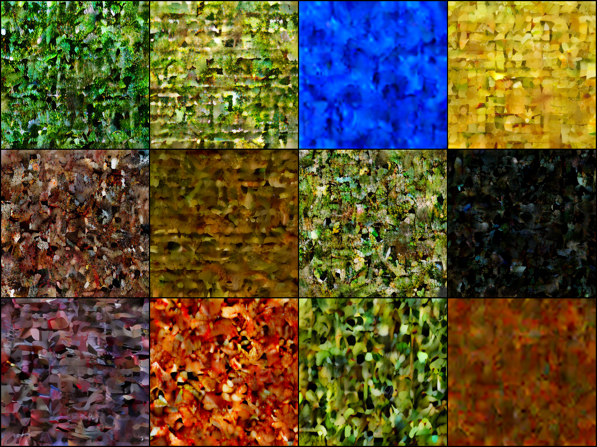

Early in training. Noise textures with class-dependent color distributions — aquatic classes skew blue, mammals skew brown/tan.

#### Step 50,000

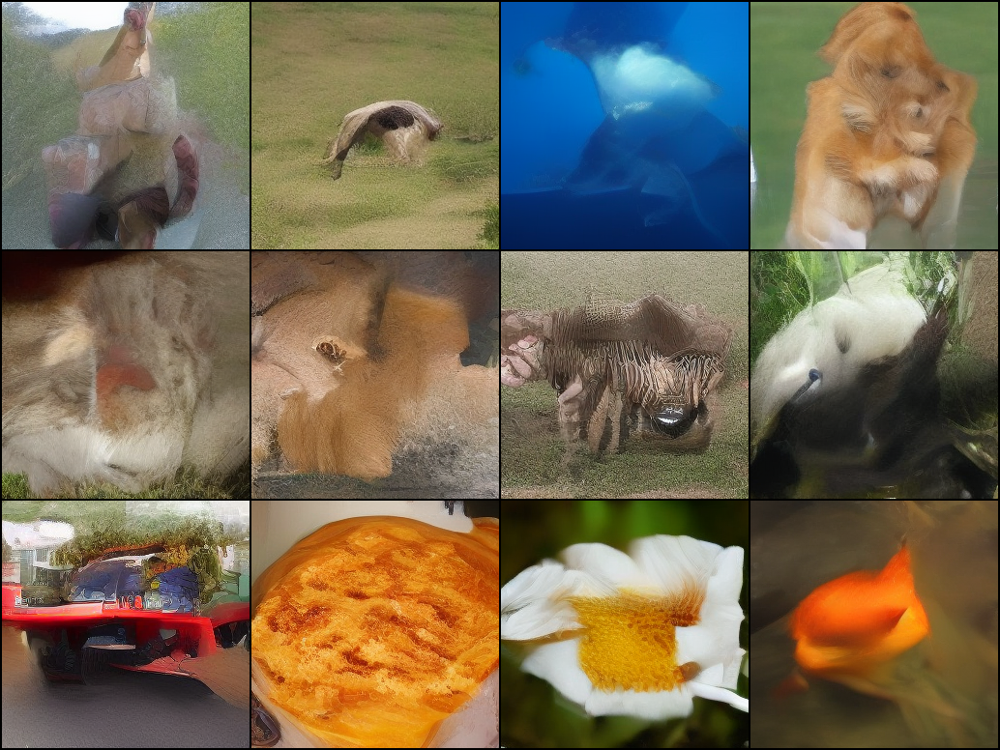

Coarse structure emerging. Object silhouettes start to form against class-appropriate backgrounds.

#### Step 100,000

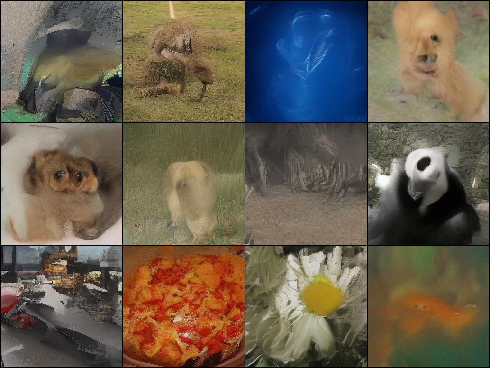

Recognizable shapes for most classes. Zebra stripes, panda head contrast, and car silhouettes appear.

#### Step 200,000

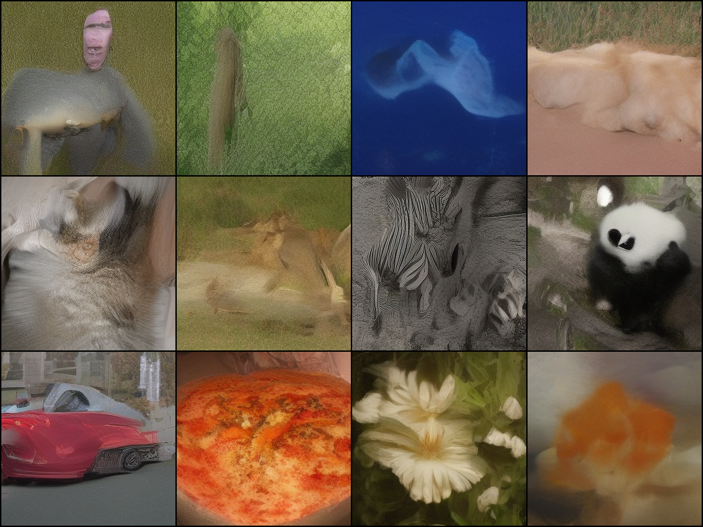

Where the 200K local run ended (Run 1 at FID 154.90). Details sharper, class conditioning strong.

#### Step 400,000

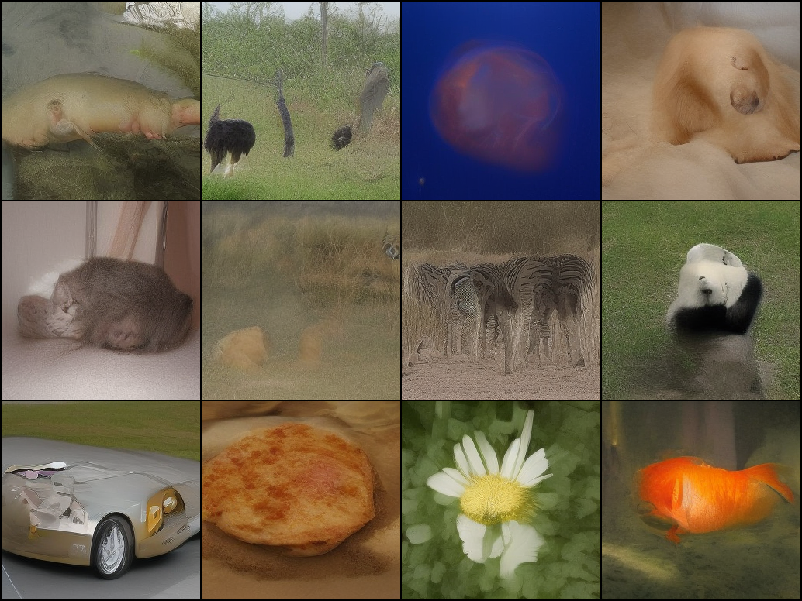

Halfway through the cloud run. Textures and proportions continue to refine, especially on animal faces.

#### Step 800,000

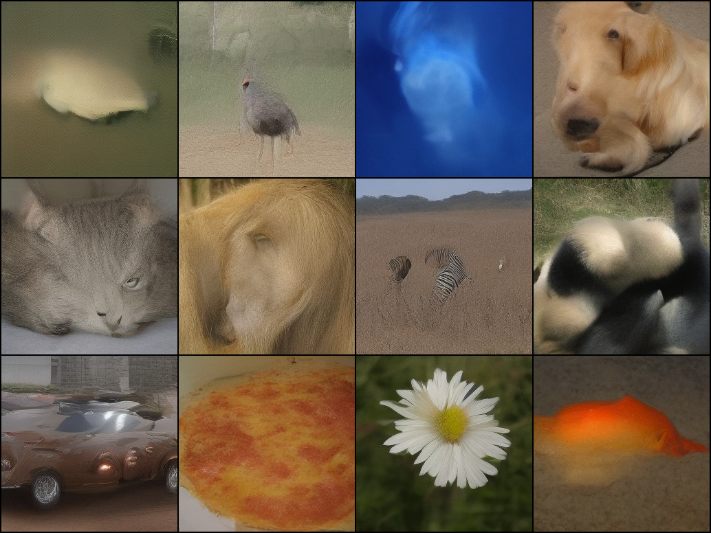

Final checkpoint. FID 140.63. The ceiling for this model size — further gains need more params and more denoising steps.

### Samples

Single samples pulled from the 50K FID set, one per class across a spread of categories (animals, objects, food, flowers). All generated at CFG=1.5, T=8, from the step 800K EMA checkpoint.

| Class | Sample |
|-------|--------|
| 0 — tench | 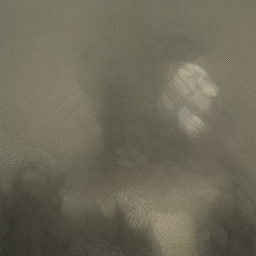 |
| 9 — ostrich | 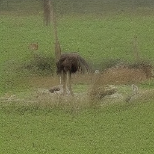 |
| 107 — jellyfish | 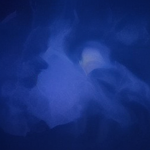 |
| 207 — golden retriever |  |
| 281 — tabby cat | 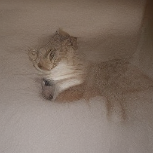 |
| 291 — lion | 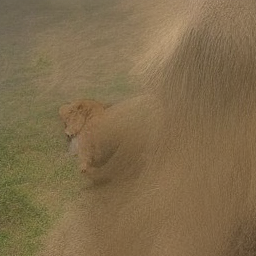 |
| 340 — zebra |  |
| 388 — panda | 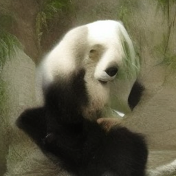 |
| 817 — sports car | 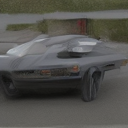 |
| 963 — pizza | 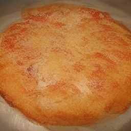 |
| 985 — daisy |  |

## Run 1: Local Training (200K steps)

### Configuration

| Setting | Value |
|---------|-------|
| Model | DART-S, 31.9M params |
| Dataset | ImageNet 256x256, 1.2M images, 941 classes |
| RoPE | 3-axis decomposed (16, 24, 24) |
| Loss weighting | Uniform |
| T | 4 denoising steps |
| Batch size | 8 |
| Steps | 200,000 |
| LR | 3e-4, cosine decay with 10K warmup |
| AMP | bf16 |
| Latent cache | Memory-mapped numpy on local disk |

Limited by 16GB VRAM, which capped batch size at 8 and T at 4.

### Sample Progression

Each grid shows 16 samples from the first 16 ImageNet classes.

#### Step 10,000

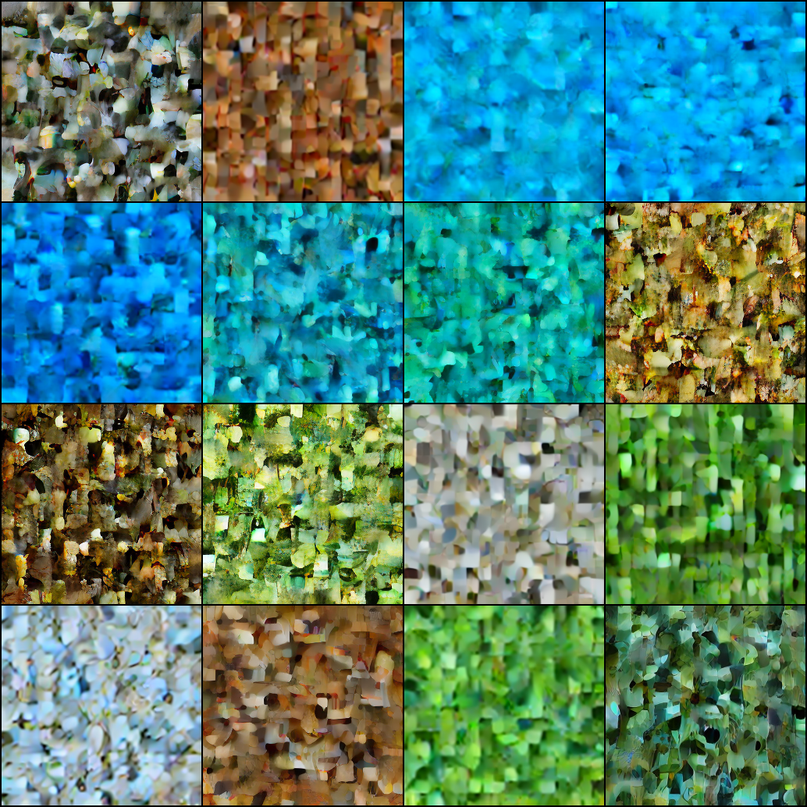

Noise with class-specific color palettes. Aquatic classes are blue, animal classes are brown/green. No shapes yet.

#### Step 50,000

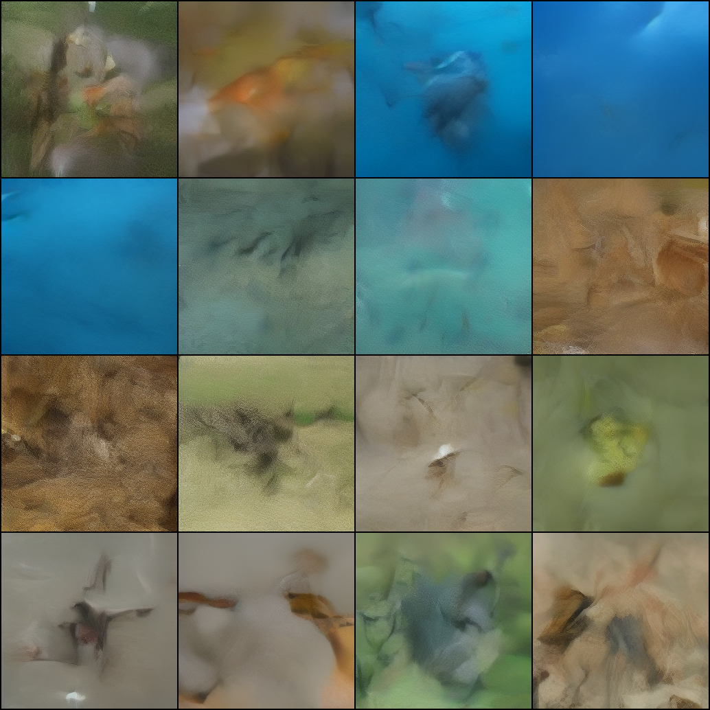

Background structure forming. Blue water scenes, green foliage, brown ground. Some blurry object silhouettes starting to appear.

#### Step 100,000

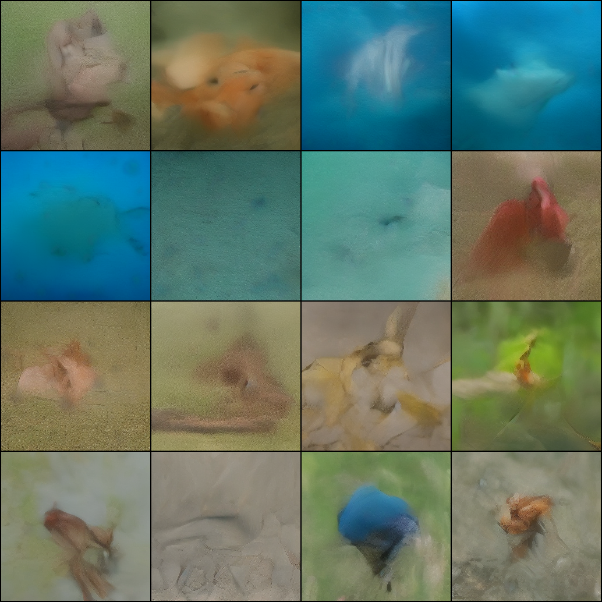

Object shapes visible. Goldfish in water, dolphins, flamingos, starfish. Colors and backgrounds clearly conditioned on class. The model has learned to associate class IDs with the right visual content across hundreds of categories.

#### Step 200,000

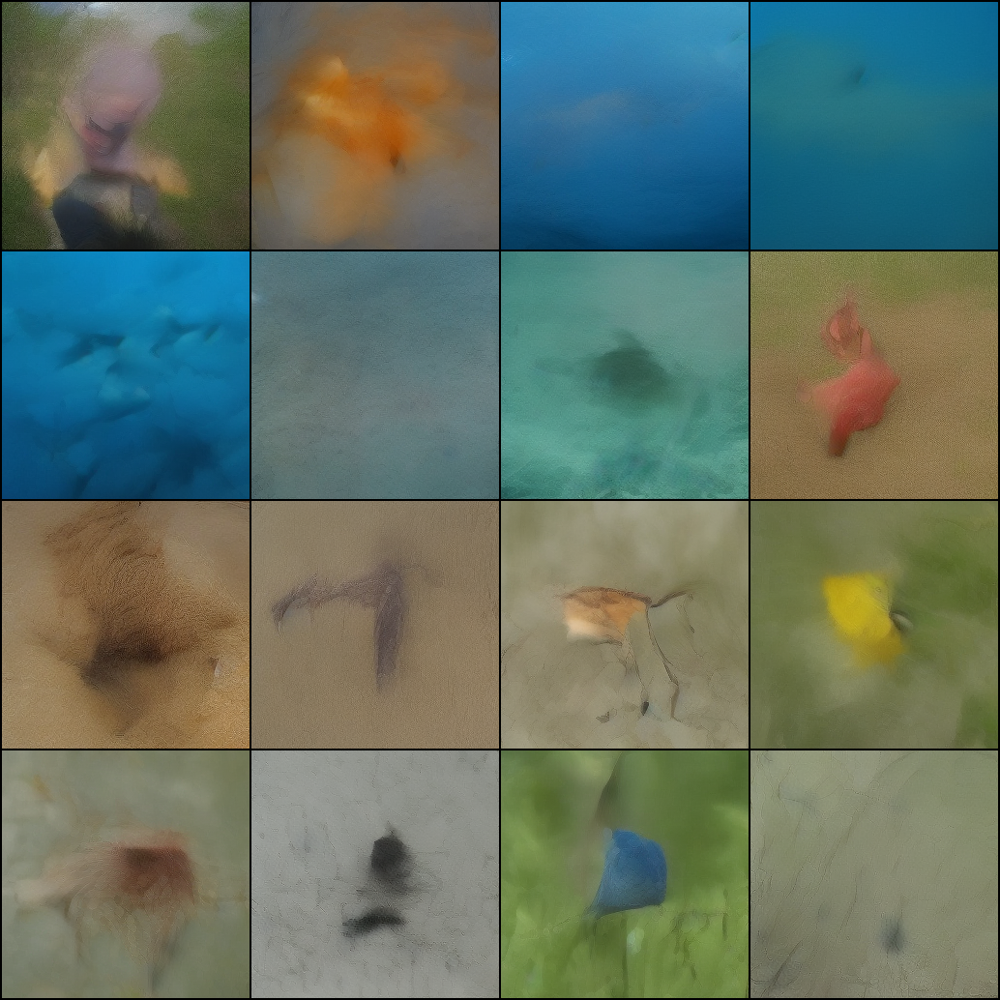

Best results for Run 1. Class conditioning is strong — you can tell fish classes from bird classes from mammal classes at a glance. Objects have recognizable silhouettes and sit in appropriate environments. Still soft at fine detail because T=4 only gives the model four chances to denoise.

## Infrastructure Notes

### Latent Caching at Scale

The original caching approach (accumulate all latents in a Python list, then `torch.cat`) crashed the machine twice when applied to 1.2M images. It tried to hold ~19GB of tensors in RAM and then doubled that during concatenation.

Fixed by switching to numpy memory-mapped files. The new approach pre-allocates the full array on disk and writes to it incrementally. RAM usage stays at ~100MB regardless of dataset size. The 1.2M image cache is ~19GB on disk and loads lazily during training.

### Silent Cache Corruption (fixed for Run 2)

A subtle bug in the Modal prep function relied on `len(existing) == n` as the "done" check — but since the mmap file is pre-allocated to full size, `len` always equals `n` even if encoding was interrupted. An initial Run 2 attempt was caught 120K steps in with loss collapsed to 0.0000 because 99% of the latent cache was zero-filled. Fixed by scanning for the last non-zero row instead. The bad run was scrapped and Run 2 was restarted with a properly-encoded cache.

### Modal Function Timeout

Modal's 24-hour function timeout required manual resume across multiple sessions. The training loop checkpoints every 10K steps (`.safetensors` EMA + `.pt` full state) and commits to the persistent volume, so resume after timeout loses only a few hundred steps per cycle.

### FID Reference

clean-fid's precomputed ImageNet 256 stats URL returned 404. Worked around by building our own 50K-image reference by streaming from HuggingFace and computing FID folder-vs-folder.

## What This Proves

The DART architecture works on ImageNet at small scale. A 32M parameter model with 8 denoising steps and 800K training steps learns meaningful class-conditional generation across all 1000 categories. FID is high compared to the paper because of the 25x parameter gap and 2x step gap, but the architecture scales in the right direction: every lever we moved (batch, T, steps, classes) improved the score.

## What Would Improve Results

- **More parameters**: DART-B (141M) or larger. Feasible on A100-80GB with gradient checkpointing.
- **More denoising steps**: T=16 matches the paper. Each step costs more VRAM but refines output.
- **CFG tuning**: Paper typically reports FID sweeps across CFG={1.0, 1.5, 2.5, 4.0}. CFG=1.5 was used here; higher values may improve FID further at the cost of diversity.
- **Longer training**: 800K steps with batch=32 means ~20 epochs. The paper likely trains hundreds of epochs.
