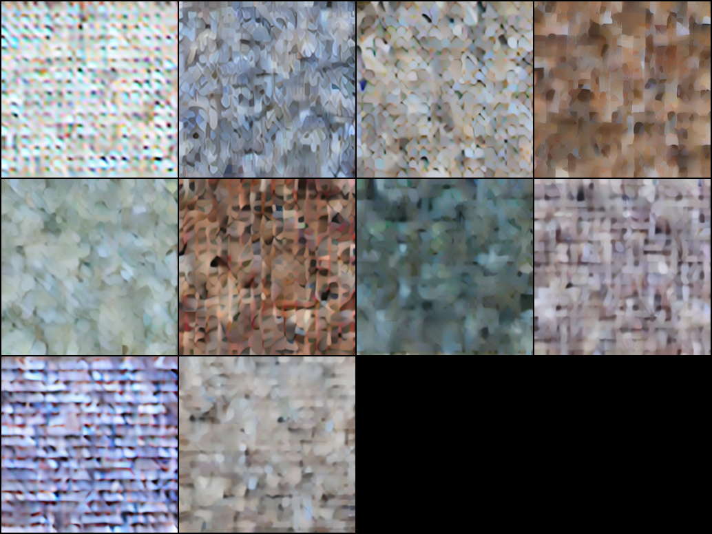
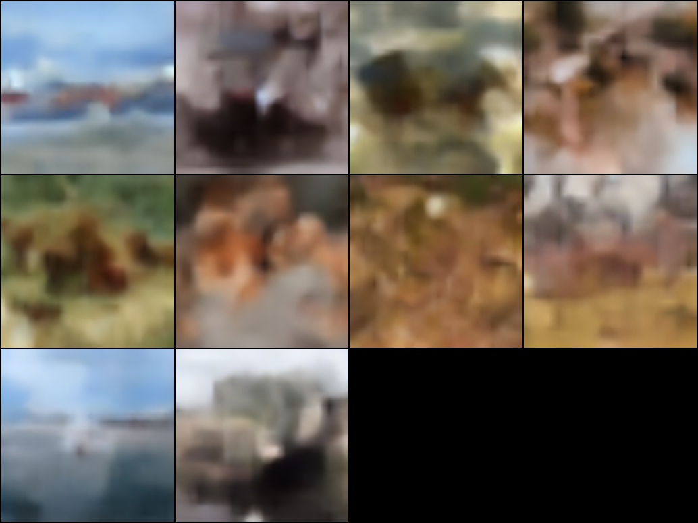
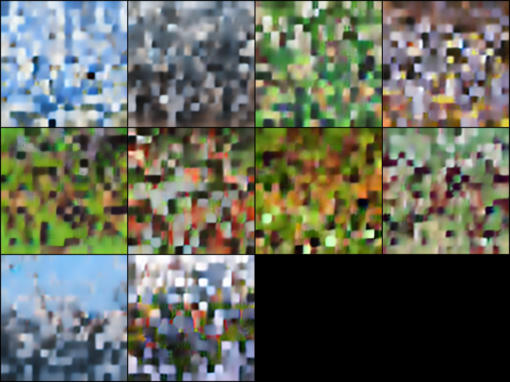
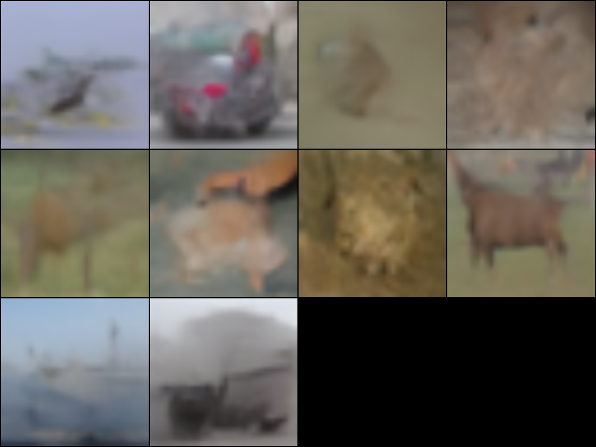
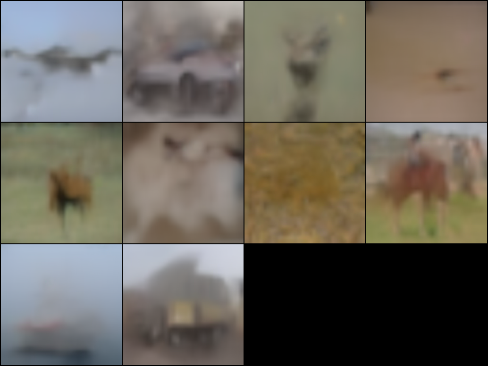

# DART Training Report: First 100K Steps

**Date:** April 2026
**Paper:** [DART: Denoising Autoregressive Transformer for Scalable Text-to-Image Generation](https://arxiv.org/abs/2410.08159) (ICLR 2025)

## Overview

This is a from-scratch reimplementation of Apple's DART paper in Python (training) and Rust (inference). DART is a hybrid between autoregressive and diffusion models. A transformer processes a sequence of progressively denoised image patches using block-wise causal attention, so each denoising step can see all the noisier steps that came before it.

This training cycle was about validating the full pipeline: does the model converge, do samples improve over time, and can the Rust inference binary load the trained weights and produce images.

## Architecture

| Component | Detail |
|-----------|--------|
| Model | DART-S (Small) |
| Parameters | 31.9M |
| Layers | 12 |
| Hidden dim | 384 |
| Attention heads | 6 (head_dim=64) |
| FFN | SwiGLU |
| Conditioning | AdaLN (class-conditional) |
| Position encoding | 3-axis decomposed RoPE (step, row, col) |
| Patch size | 2x2 over VAE latents |
| VAE | Stable Diffusion v1 (stabilityai/sd-vae-ft-ema) |
| Loss | MSE on v-prediction targets |

### 3-Axis Decomposed RoPE

Following Section B.1 of the paper, rotary position embeddings are split into three axes:

- **Denoising step** (16 dims): which noise level in the T-step sequence
- **Spatial row** (24 dims): vertical position in the 16x16 patch grid
- **Spatial column** (24 dims): horizontal position in the grid

Without this, the model sees all 1024 tokens as a flat sequence with no notion of 2D layout or which denoising step they belong to. The decomposition makes those relationships explicit.

## Training Configuration

| Setting | Value |
|---------|-------|
| Dataset | CIFAR-10 (50K images, 10 classes) |
| Image resolution | 32x32 upscaled to 256x256 |
| Denoising steps (T) | 4 |
| Tokens per step (K) | 256 (16x16 grid) |
| Total sequence length | 1024 |
| Batch size | 8 |
| Optimizer | AdamW (lr=3e-4, betas=0.9/0.95, wd=0.01) |
| LR schedule | Linear warmup (10K steps) + cosine decay |
| EMA decay | 0.9999 |
| Gradient clipping | 2.0 |
| Mixed precision | bf16 autocast |
| Gradient checkpointing | Enabled |
| CFG dropout | 10% unconditional |
| CFG scale (sampling) | 1.5 |
| Total steps | 100,000 |
| Hardware | NVIDIA RTX 4080 (16GB VRAM) |

## Sample Progression

Each grid shows one sample per CIFAR-10 class (airplane, automobile, bird, cat, deer, dog, frog, horse, ship, truck), generated with classifier-free guidance at scale 1.5.

### Step 5,000

Mostly noise. The model has picked up on rough color distributions per class but there's no spatial structure.

### Step 20,000

Backgrounds start making sense: sky gradients, water, green/brown terrain. You can tell which classes are "outdoor" vs not. Objects themselves aren't there yet.

### Step 30,000

Per-class color palettes are stronger. There are visible blocky artifacts from the 16x16 patch grid as the model figures out how to coordinate predictions across spatial positions.

### Step 75,000

Objects are recognizable now. Cars have windshields, horses stand in profile, ships sit on water. Backgrounds are coherent and match the class.

### Step 100,000 (Final)

Best results from this run. Objects have correct proportions and sit in appropriate contexts (horses on grass, ships on water, cars on roads). The blur is a hard limit from CIFAR-10's 32x32 source images being upscaled to 256x256.

## Training Dynamics

### Loss

| Step Range | Loss | Notes |
|-----------|------|-------|
| 0-5K | ~0.45-0.50 | High variance, initial learning |
| 5K-20K | ~0.40-0.45 | Steady drop |
| 20K-40K | ~0.33-0.40 | Fastest improvement phase |
| 40K-70K | ~0.30-0.35 | Diminishing returns |
| 70K-100K | ~0.28-0.35 | Plateauing |

No NaN or divergence across the full run.

### Speed

| Phase | Speed | Why |
|-------|-------|-----|
| Steps 0-70K (no cache) | ~1.9 it/s | VAE encoder running every batch |
| Steps 70K-100K (cached latents) | ~8 it/s | Just the transformer |

CIFAR-10 only has 50K images. Running every image through the VAE encoder 16+ times is wasteful. Caching all the latents to disk once (~820MB) and loading them directly gave a ~4x speedup.

## Problems Hit Along the Way

### fp16 NaN at ~30K steps

The first training attempt used fp16 mixed precision with PyTorch's `GradScaler`. It consistently blew up around step 30K-35K. The loss would go NaN, the scaler would shrink its scale factor, more NaNs would follow, and eventually all gradients underflowed to zero. The model was dead but the training loop kept running (NaN protection skipped the bad steps, but the weights were already corrupted).

Fix: switched to bf16. It has 8 exponent bits (same as fp32) instead of fp16's 5, so the dynamic range is large enough that you don't need loss scaling at all. Dropped the `GradScaler` entirely. Training ran clean for 100K steps after that.

### Windows DataLoader crashes

PyTorch's DataLoader with `num_workers > 0` on Windows exhausts shared memory on long runs. Setting `--workers 0` avoids it. The latent caching later made this irrelevant since the cached dataset is just a tensor load.

### Surviving crashes on consumer hardware

A 100K step run takes hours on a single 4080. Power blips, Windows updates, etc. can kill it. Checkpoint resume (full optimizer/scheduler/EMA state saved every 5K steps) plus a watchdog script that auto-restarts on crash made this manageable.

## Stack

- **Training:** Python, PyTorch
- **Inference:** Rust, [candle](https://github.com/huggingface/candle)
- **Weight format:** Safetensors (Python writes, Rust reads)
- **VAE:** Stable Diffusion v1 encoder/decoder, used in both runtimes

The whole pipeline works end-to-end: train in Python, export safetensors, load in Rust, run inference, decode through VAE, get a PNG.

## Limitations

- **CIFAR-10 is the wrong dataset for this.** 32x32 images upscaled to 256x256 can't produce sharp results no matter how long you train. Need a native high-res dataset to see what the model can really do.
- **T=4 is low.** The paper uses T=16 for their best results. 16GB VRAM limits us to 4 steps, which means coarser denoising. Each step has to do more work.
- **No quantitative eval.** Haven't computed FID or IS yet. Everything here is qualitative.

## What's Next

1. Train on a native 256x256 dataset (CelebA-HQ, LSUN, or similar) to get past the CIFAR blur ceiling
2. Run Rust inference on the 100K checkpoint and compare outputs against Python
3. Compute FID/IS on CIFAR-10 test set
4. Try T=8 now that latent caching frees up some VRAM headroom
