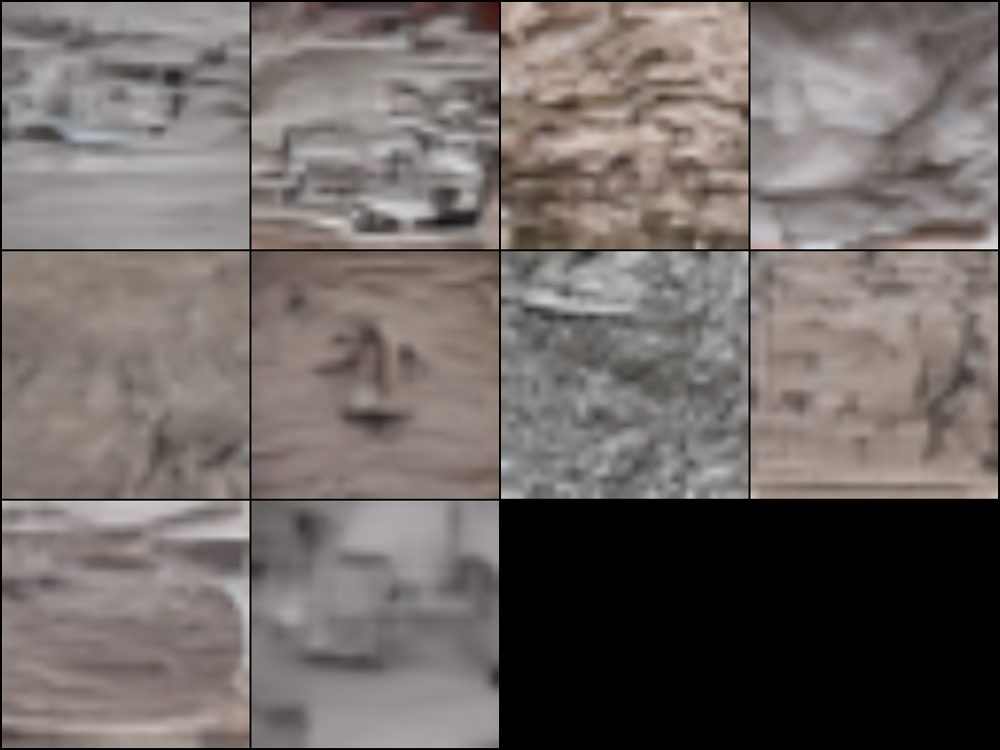

# DART Training Report

**Date:** April 2026
**Paper:** [DART: Denoising Autoregressive Transformer for Scalable Text-to-Image Generation](https://arxiv.org/abs/2410.08159) (ICLR 2025)

## Overview

From-scratch reimplementation of Apple's DART paper. Python for training, Rust for inference. Two full 100K-step training cycles completed on CIFAR-10 with different configurations. Full pipeline verified end-to-end: Python trains, exports safetensors, Rust loads and generates images through the VAE decoder.

## Architecture

| Component | Detail |
|-----------|--------|
| Model | DART-S (Small), 31.9M params |
| Layers / Hidden / Heads | 12 / 384 / 6 (head_dim=64) |
| FFN | SwiGLU |
| Conditioning | AdaLN (class-conditional) |
| Position encoding | 3-axis decomposed RoPE (step, row, col) |
| Patch size | 2x2 over 4-channel VAE latents |
| VAE | Stable Diffusion v1 (stabilityai/sd-vae-ft-ema) |
| Prediction target | v-prediction: v = alpha * noise - sigma * x0 |

## Training Runs

### Run 1: Flat RoPE + Uniform Loss (baseline)

The first successful run. The "3D RoPE" code was present but a bug caused the model to use flat RoPE frequencies throughout (a registered buffer was overwritten by checkpoint loading on every resume).

| Setting | Value |
|---------|-------|
| RoPE | Flat (dim=64, single geometric series) |
| Loss weighting | Uniform across all T steps |
| AMP | bf16 |
| Steps | 100,000 |
| Batch size | 8 |
| LR | 3e-4, cosine decay with 10K warmup |
| T | 4 denoising steps |
| Dataset | CIFAR-10, 50K images, 10 classes |
| Hardware | RTX 4080 16GB |

**Results at 100K steps:**

Recognizable class-conditioned images. Cars, horses, deer, ships, birds all distinguishable with appropriate backgrounds. Blur is from CIFAR-10's 32x32 source resolution upscaled to 256x256.

Loss settled around 0.28-0.35.

### Run 2: True 3D RoPE + SNR Loss Weighting

Fixed the RoPE bug (stopped registering inv_freq as a buffer so checkpoints can't overwrite it). Also added the paper's SNR-based loss weighting from Eq. 7.

| Setting | Value |
|---------|-------|
| RoPE | 3-axis decomposed: (16, 24, 24) for (step, row, col) |
| Loss weighting | SNR: omega_t = sum(gamma_tau / (1 - gamma_tau)) for tau=t..T |
| Everything else | Same as Run 1 |

The SNR weighting with T=4 is extreme: step t=1 gets 84% of the loss, t=2 gets 14%, t=3 gets 2%, t=4 gets ~0%.

**Results at 100K steps:**

Worse than Run 1. Washed-out brownish tone across all classes, weak class differentiation. The model learned to refine near-clean images (t=1) but never learned the initial denoising from noise (t=4 got zero gradient). Since sampling starts from pure noise, the first prediction is poor and later steps can't recover.

Loss was lower (~0.19-0.22) because the loss is dominated by the easy step, but sample quality suffered.

### Takeaway

The paper's SNR weighting formula was designed for T=16 where the weight distribution is more gradual. At T=4, the weighting is too extreme. Flat RoPE with uniform loss weighting gave better results on this small-T, small-dataset setup.

A third run is planned with 3D RoPE + uniform loss weighting to isolate whether the RoPE change helps or hurts.

## Training Infrastructure

### Latent Caching
The VAE encoder was running on every batch, bottlenecking training at ~1.9 it/s. Pre-caching all 50K latents to disk (~820MB) and loading them as a tensor dataset removed the VAE from the training loop entirely. Speed jumped to ~10.4 it/s.

### OneDrive I/O
Checkpoints were initially saved to an OneDrive-synced folder. Each 637MB save (safetensors + .pt) triggered a background sync that blocked writes for minutes, dragging down the running-average it/s metric permanently. Moving checkpoints to a local path (`C:\dart_checkpoints\`) fixed it.

### bf16 vs fp16
fp16 with GradScaler consistently went NaN at ~30K steps. The scaler's dynamic loss scaling would shrink to near-zero after repeated NaN detections, underflowing all gradients. bf16 has the same exponent range as fp32, needs no scaler, and ran 100K steps without a single NaN on both runs.

### Watchdog
A PowerShell script monitors the training process and auto-restarts from the latest checkpoint on crash. Reads the actual step count from the .pt file to determine completion.

## RoPE Bug Post-Mortem

The 3D RoPE implementation registered `inv_freq` as a PyTorch buffer via `register_buffer()`. The old flat RoPE class used the same buffer name with the same shape (32 elements). When training resumed from any checkpoint, `load_state_dict()` silently overwrote the freshly computed 3D frequencies with the old flat values.

This went undetected because:
- The model still trained (flat frequencies still encode some positional info)
- The loss decreased normally
- Samples improved over time
- The buffer name and shape matched, so no errors were raised

The Rust inference code computed correct 3D frequencies from scratch, causing a mismatch that produced blocky blue noise instead of images. Tracing the divergence layer-by-layer eventually revealed the inv_freq values didn't match between Python and Rust.

Fix: changed `register_buffer("inv_freq", ...)` to a plain attribute `self.inv_freq = ...`. Rust now loads inv_freq from the checkpoint when present, falls back to computing from config when absent.

## Stack

- **Training:** Python, PyTorch, bf16 autocast, cached VAE latents
- **Inference:** Rust, candle (HuggingFace), CPU (CUDA build requires CUDA toolkit)
- **Weight format:** safetensors
- **VAE:** SD v1 encoder/decoder, shared across both runtimes

## What's Next

1. Run 3 (in progress): 3D RoPE + uniform loss weighting
2. Train on Food-101 or Flowers-102 for native high-res images
3. Experiment with T=8 for finer denoising
4. FID evaluation (now in train_cloud.py::fid_eval)
5. KV-cache for faster sampling
